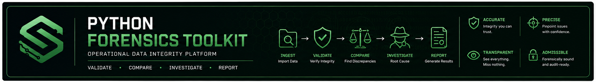
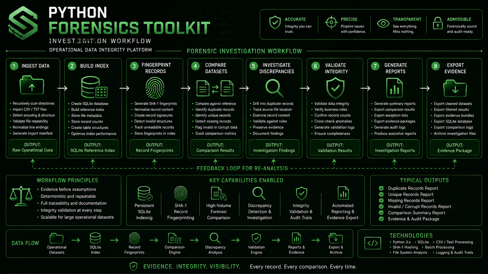
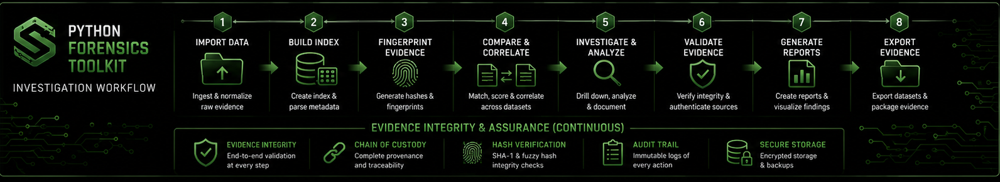

<p align="center">
  
</p>

# Python Forensics Toolkit

## Operational Data Integrity Platform

**A modular Python toolkit for forensic comparison, data integrity validation, record fingerprinting, evidence analysis, discrepancy detection, and operational reporting.**

---

# Executive Summary

Python Forensics Toolkit is a production-oriented forensic analysis platform engineered to compare, validate, and investigate extremely large operational datasets.

Rather than functioning as isolated utilities, the repository represents an integrated forensic workflow where each module performs a defined investigative responsibility while contributing to a repeatable evidence-based analysis process.

The platform emphasizes integrity verification, reproducible comparison methodologies, persistent indexing, and structured reporting suitable for high-volume operational environments.

---

# Why This Platform Exists

Organizations routinely inherit multiple copies of operational data originating from different systems, exports, vendors, and historical archives.

As those datasets grow, determining what changed, what matches, and what can safely be removed becomes increasingly difficult.

Common challenges include:

- Duplicate datasets
- Unknown record integrity
- Missing records
- Conflicting exports
- Manual comparison
- Poor audit visibility
- Inefficient investigations
- High verification costs

Python Forensics Toolkit was engineered to automate those investigative processes while preserving evidence and producing repeatable analytical results.

---

# Engineering Philosophy

Operational investigations should be driven by evidence rather than assumptions.

Every comparison performed by this platform follows deterministic processing designed to minimize manual effort while maximizing confidence in the resulting conclusions.

Each module contributes to a repeatable forensic workflow that supports transparency, auditability, and operational decision-making.

---

# Platform Objectives

The platform was engineered around five forensic engineering principles.

## Integrity

Verify data before making operational decisions.

## Repeatability

Produce consistent forensic results regardless of dataset size.

## Traceability

Maintain evidence throughout every stage of analysis.

## Scalability

Support investigations involving millions of operational records.

## Reporting

Generate actionable findings supported by measurable evidence.

---

# High-Level Architecture

<p align="center">
  
</p>

The architecture separates forensic analysis into modular investigative stages allowing each process to perform one clearly defined responsibility while contributing to a comprehensive evidence-based workflow.

Core processing stages include:

- Import
- Index
- Fingerprint
- Compare
- Investigate
- Validate
- Report

---

# Investigation Workflow

<p align="center">
  
</p>

Typical investigations follow this sequence:

1. Import operational datasets
2. Build SQLite reference indexes
3. Generate record fingerprints
4. Compare operational datasets
5. Identify discrepancies
6. Validate findings
7. Produce investigation reports
8. Export supporting evidence

---

# Repository Structure

```text
python-forensics-toolkit/
│
├── banner-python-forensics.png
├── architecture-python-forensics.png
├── workflow-python-forensics.png
│
├── run_C1_forensic_compare.py
├── run_section_compare.py
├── README.md
├── LICENSE
└── .gitignore
```

---

# Core Components

### `run_C1_forensic_compare.py`

Builds a persistent SQLite reference index and performs large-scale forensic comparison across operational datasets, identifying duplicate, unique, invalid, and unreadable records.

### `run_section_compare.py`

Performs targeted forensic comparison between selected operational sections and trusted reference datasets while generating detailed comparison summaries.

---

# Technology Stack

## Languages

- Python

## Data

- SQLite
- CSV
- Text Processing
- Record Fingerprinting
- Persistent Indexing

## Engineering

- Forensic Comparison
- Operational Analytics
- Data Validation
- Evidence Collection
- Audit Reporting
- Batch Processing
- Recursive File Analysis

---

# Engineering Highlights

- Persistent SQLite indexing
- SHA-1 record fingerprinting
- Deterministic comparison engine
- High-volume forensic processing
- Evidence preservation
- Dataset validation
- Automated reporting
- Operational analytics
- Scalable architecture
- Engineering-first design philosophy

---

# Operational Use Cases

The platform supports investigations involving:

- Dataset comparison
- Evidence validation
- Duplicate detection
- Record verification
- Migration analysis
- Historical reconciliation
- Operational auditing
- Compliance reporting
- Data integrity reviews

---

# Future Roadmap

Planned areas of expansion include:

- Multi-threaded comparison engine
- Configuration-driven investigations
- Structured logging
- Dashboard reporting
- REST API integration
- Cloud execution
- Automated evidence packages
- Interactive investigation reports
- Sample forensic datasets

---

# Security Note

SHA-1 is used exclusively for record-equality fingerprinting and comparison efficiency.

It is not used for password storage, authentication, encryption, or other security-sensitive functions.

No confidential operational datasets are included in this repository.

---

# Author

**Patrick Estrada**

Systems Architect  
Automation Engineer  
Operational Software Engineer  
AI-Assisted Development  
Mission-Critical Operations

---

# License

Released under the MIT License.

See the `LICENSE` file for additional information.
